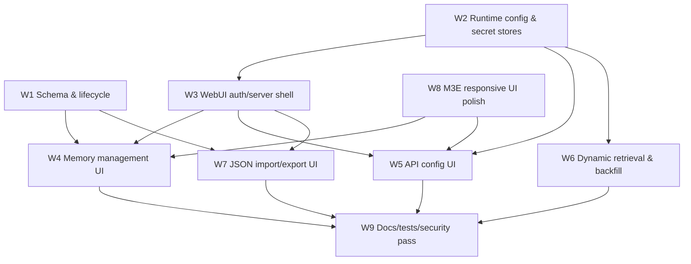

# Agent Taskbook: WebUI Admin Console Roadmap

本文档用于分发给多个 agent 并行实现 `research-memory-gateway` 的 WebUI 管理台。每个任务包应在独立分支或独立 Agent Manager worktree 中完成，完成后提交小而清晰的 PR 或 commit。

## 0. WebUI 总体决策

### 产品定位

WebUI 是 `research-memory-gateway` 的**单管理员私有管理台**，用于管理科研记忆、配置外部 API、观察检索状态和执行受控维护任务。

WebUI 不替代 MCP。MCP 仍然是 AI 客户端的正式接口。

```text
AI clients
  -> MCP tools
  -> ResearchMemoryService
  -> SQLite

Admin user
  -> WebUI
  -> internal /admin/api/*
  -> ResearchMemoryService
  -> SQLite
```

### 部署决策

- WebUI 与现有 MCP 服务在**同一个容器**内运行。
- WebUI 使用**独立端口**，默认建议 `8788`。
- WebUI 默认关闭。
- 用户显式配置后开启。
- 端口是否暴露到宿主机或公网由 Docker/部署文件决定。
- WebUI 前端资源全部本地 vendored，不使用 CDN。

### 安全决策

- 只支持单管理员。
- 登录必须有密码。
- 支持从 `config.webui.initial_password` 首次 bootstrap。
- 首次启动自动 hash 密码，写入 auth store。
- 不改写主 `config.yaml`。
- 后续允许在 WebUI 修改密码。
- 使用固定过期 session，不做“记住我”。
- 写操作必须 session auth + CSRF。
- 危险操作需要二次确认。
- API key/token 永不明文返回、永不写日志、永不写入 `web_config.yaml`。

### UI 决策

- 服务端渲染 HTML。
- 少量 HTMX / Alpine.js。
- M3E + 毛玻璃设计。
- 支持电脑、平板、手机自适应。
- 支持 `system / light / dark` 主题，默认跟随系统。
- 前端资源全部放在本地 static 目录。

### 记忆管理决策

- 支持查看、搜索、手动创建、编辑、归档、软删除、恢复、hard delete。
- `memory_type` 固定，不允许用户自定义。
- 不同研究方向用 `project / topic / tags` 管理。
- 只做分类管理，不做强隔离。
- `ResearchMemory` 顶层新增 `memory_status`。
- 状态实现：
  - `active`
  - `archived`
  - `deleted`
- 普通搜索和 AI 检索默认只返回 `active`。
- `archived` / `deleted` 需要显式包含。
- `check_overlap` 默认包含 `active + archived + deleted`。
- `audit_unverified` 默认只审计 `active`。
- `export_memories` 默认只导出 `active`。
- hard delete 只在 `deleted` 详情页 Danger Zone 中出现。

### 配置决策

配置分层如下：

```text
config.yaml
  启动级配置，不由 WebUI 常规修改。

./data/web_config.yaml
  WebUI 可写的非密钥运行时配置，可热更新。

./data/webui-secrets.json.enc
  WebUI 加密保存 API key / token。

./data/webui-auth.json
  WebUI 登录密码 hash。

SQLite
  memories / FTS / embeddings / audit_events。
```

配置优先级：

```text
密钥类:
  env > webui-secrets.json.enc > unset

非密钥运行时配置:
  env > web_config.yaml > config.yaml > code defaults

启动级配置:
  env > config.yaml > code defaults
```

### Retrieval 决策

WebUI 允许立即生效地修改：

```text
retrieval.mode: keyword / hybrid

embedding.enabled
embedding.base_url
embedding.api_key
embedding.model
embedding.endpoint_path
embedding.timeout_seconds
embedding.max_retries

rerank.enabled
rerank.base_url
rerank.api_key
rerank.model
rerank.endpoint_path
rerank.timeout_seconds
rerank.max_retries
```

WebUI 支持受控 embedding backfill：

- dry-run
- 限流
- 进度显示
- concurrency 设置
- request timeout 设置
- job timeout 设置
- 同时只允许一个 backfill job
- 单个 job 内允许配置并发数量

### Nocturne 决策

WebUI v1 只做：

- Nocturne 配置保存
- token 加密保存
- 连接测试
- capabilities/status 预留

不做：

- SQLite -> Nocturne 同步
- Nocturne -> SQLite 导入
- 双写
- Nocturne 作为默认 backend
- WebUI 直接编辑 Nocturne 记忆

### 导入决策

WebUI v1 支持 JSON 记忆导入。

Markdown 不直接导入为普通记忆。后续预留：

- Markdown 向量索引
- AI 分析 Markdown 生成 ResearchMemory JSON
- 与其它 MCP 联动

## 1. 推荐执行顺序



建议顺序：

1. Agent W1：Memory lifecycle schema and SQLite migration。
2. Agent W2：Web runtime config, auth store, secret store, resolver。
3. Agent W3：WebUI server shell, login/session/CSRF/static assets。
4. Agent W4：Memory management pages and internal APIs。
5. Agent W5：API config, effective config, Nocturne reserved connector。
6. Agent W6：Dynamic retrieval hot config and backfill jobs。
7. Agent W7：JSON import/export UI。
8. Agent W8：M3E + glassmorphism responsive UI system。
9. Agent W9：Docs, tests, security hardening, integration cleanup。

# Agent W1: Memory Lifecycle Schema And Search Semantics

## Goal

为 `ResearchMemory` 增加 memory 级生命周期状态，并让 MCP、SQLite、搜索、审计、导出统一理解 `active / archived / deleted`。

## Scope

- 在 `models.py` 新增：

```python
class MemoryStatus(str, Enum):
    active = "active"
    archived = "archived"
    deleted = "deleted"
```

- 在 `ResearchMemory` 顶层新增字段：

```python
memory_status: MemoryStatus = MemoryStatus.active
status_changed_at: str | None = None
status_change_reason: str | None = None
```

- SQLite `memories` 表新增辅助列：

```sql
memory_status TEXT NOT NULL DEFAULT 'active'
status_changed_at TEXT
```

- 保存记忆时同步写入 `memory_status` 和 `status_changed_at`。
- `list_all`、`search`、`check_overlap`、`audit_unverified`、`export_memories` 支持状态过滤语义。
- `search_research_memory` 默认只返回 `active`。
- `check_overlap` 默认包含 `active + archived + deleted`。
- `audit_unverified` 默认只审计 `active`。
- `export_memories` 默认只导出 `active`。
- 增加 service 方法：
  - archive memory
  - restore memory
  - soft delete memory
  - hard delete memory
- hard delete 删除：
  - `memories`
  - `memories_fts`
  - `memory_embeddings`
- 更新 tests。

## Out Of Scope

- 不做 WebUI 页面。
- 不做完整 revision history。
- 不做 Nocturne tombstone 同步。
- 不做批量 hard delete。

## Acceptance Criteria

- 旧数据库打开后自动补齐状态列，已有记忆默认为 `active`。
- 默认搜索不返回 `archived` 和 `deleted`。
- 显式 include 参数可包含 `archived` / `deleted`。
- `check_overlap` 默认能发现 deleted 记忆并标明状态。
- `audit_unverified` 默认不包含 archived/deleted。
- hard delete 会物理删除主表、FTS、embedding。
- 所有新增行为有单元测试。
- `pytest` 通过。

## Suggested Prompt

```text
Implement Agent W1 from docs/webui-agent-taskbook.md. Add ResearchMemory memory_status lifecycle support with active/archived/deleted, SQLite migration columns, search/audit/export filtering semantics, and service methods for archive/restore/soft-delete/hard-delete. Do not build WebUI pages. Add tests and run pytest.
```

# Agent W2: Web Runtime Config, Auth Store, Secret Store, Resolver

## Goal

建立 WebUI 所需的配置分层、密码 bootstrap、加密 secrets 和运行时 resolver，为后续 WebUI/API/retrieval 热更新提供基础。

## Scope

### Config model

在 `config.py` 增加 `WebUIConfig`：

```yaml
webui:
  enabled: false
  host: "127.0.0.1"
  port: 8788
  web_config_path: "./data/web_config.yaml"
  auth_store_path: "./data/webui-auth.json"
  secret_store_path: "./data/webui-secrets.json.enc"
  initial_password: null
  session_max_age_seconds: 43200
```

### `web_config.yaml`

实现 WebUI 可写的非密钥配置模型：

```yaml
retrieval:
  mode: keyword | hybrid

embedding:
  enabled: false
  base_url: null
  model: null
  endpoint_path: "/embeddings"
  timeout_seconds: 30
  max_retries: 1

rerank:
  enabled: false
  base_url: null
  model: null
  endpoint_path: "/rerank"
  timeout_seconds: 30
  max_retries: 1

nocturne:
  transport: unknown | rest | sse | streamable_http | stdio
  url: null

backfill:
  default_scope: active
  default_batch_size: 8
  default_concurrency: 2
  default_request_timeout_seconds: 30
  default_job_timeout_seconds: 1800
```

### Auth store

实现：

```text
./data/webui-auth.json
```

保存：

```json
{
  "version": 1,
  "password_hash": "...",
  "created_at": "...",
  "updated_at": "..."
}
```

规则：

```text
1. auth store 存在时，使用 auth store。
2. auth store 不存在且 WEBUI_PASSWORD_HASH 存在时，使用 env hash。
3. auth store 不存在且 config.webui.initial_password 存在时，hash 后写入 auth store。
4. 否则 WebUI 不允许启动。
```

支持后续修改密码：

```text
verify current password
hash new password
write auth store
```

### Secret store

实现：

```text
./data/webui-secrets.json.enc
```

保存密钥：

```text
embedding.api_key
rerank.api_key
nocturne.token
```

要求：

- 使用 `WEBUI_SECRET_KEY` 派生加密密钥。
- 没有 `WEBUI_SECRET_KEY` 时 WebUI 可启动，但禁止保存 API key/token。
- secret 响应只返回 masked value 和 configured 状态。
- 日志永不打印 secret。
- secrets 原子写入。

### RuntimeConfigResolver

实现 resolver：

```text
env > webui secrets / web_config.yaml > config.yaml > defaults
```

要求能返回：

- effective retrieval config
- effective embedding config
- effective rerank config
- effective nocturne config
- 每个字段的 source：`env / web_config / secret_store / config / default / unset`

## Out Of Scope

- 不做 WebUI 页面。
- 不接入 retrieval 实际调用。
- 不做 Nocturne 同步。
- 不做多用户系统。

## Acceptance Criteria

- `config.webui.initial_password` 首次 bootstrap 后生成 hash store。
- auth store 存在后 initial_password 不再参与登录。
- 可验证密码和修改密码。
- 没有 `WEBUI_SECRET_KEY` 时保存 secret 失败且错误清晰。
- secret store 响应不泄漏明文。
- `web_config.yaml` 原子写入并 schema 校验。
- resolver 能正确体现优先级和 source。
- 新增 tests 覆盖 bootstrap、secret masking、env override、web_config override。
- `pytest` 通过。

## Suggested Prompt

```text
Implement Agent W2 from docs/webui-agent-taskbook.md. Add WebUI config models, web_config.yaml runtime settings, auth store password bootstrap/change support, encrypted secret store, and RuntimeConfigResolver with env precedence. Do not build UI pages. Add tests and run pytest.
```

# Agent W3: WebUI Server Shell, Auth, Session, CSRF, Static Assets

## Goal

在同一容器内启动独立端口 WebUI，提供登录、session、CSRF、基础 SSR layout 和本地 static assets。

## Scope

- 新增 WebUI app 模块，例如：

```text
src/research_memory_gateway/webui/
  app.py
  auth.py
  csrf.py
  templates/
  static/
```

- WebUI 独立端口运行：

```text
MCP:   config.server.port, default 8787
WebUI: config.webui.port, default 8788
```

- `WEBUI_ENABLED=false` 时不启动 WebUI。
- `WEBUI_ENABLED=true` 时启动 WebUI。
- 缺少可用 password hash 时拒绝启动 WebUI，并输出明确错误。
- 登录页：
  - `GET /admin/login`
  - `POST /admin/login`
- 登出：
  - `POST /admin/logout`
- session：
  - HttpOnly cookie
  - SameSite=Lax
  - fixed max age
  - no remember-me
- CSRF：
  - 所有写操作保护
  - `/admin/api/*` 写操作也保护
- 静态资源全部本地：
  - HTMX
  - Alpine.js
  - app.css
  - admin.js
  - icons
- CSP 基础安全 header：
  - `default-src 'self'`
  - `img-src 'self' data:`
  - `connect-src 'self'`
  - `frame-ancestors 'none'`
- 基础页面：
  - dashboard placeholder
  - memories placeholder
  - config placeholder
  - audit placeholder
  - import/export placeholder
- 密码修改页面：
  - 输入当前密码
  - 输入新密码
  - 成功后注销 session
  - 写 audit event，如果 audit_events 已可用；否则预留 hook

## Out Of Scope

- 不实现完整 memory CRUD。
- 不实现 API 配置编辑。
- 不实现 backfill。
- 不追求最终 M3E 视觉 polish，留给 W8。

## Acceptance Criteria

- WebUI 默认不启动。
- 开启后可访问 `/admin/login`。
- 未登录访问 `/admin/*` 会跳转或拒绝。
- 登录成功后可访问 dashboard。
- session 过期后需要重新登录。
- POST 写操作没有 CSRF 会失败。
- 前端资源不访问 CDN。
- 修改密码后旧 session 失效。
- 新增 tests 或 integration smoke 覆盖登录/session/CSRF。
- `pytest` 通过。

## Suggested Prompt

```text
Implement Agent W3 from docs/webui-agent-taskbook.md. Add a Starlette SSR WebUI shell on a separate port with login, fixed-expiry session, CSRF, local static assets, placeholder admin pages, password change, and no CDN. Depend on W2 config/auth store APIs. Add tests and run pytest.
```

# Agent W4: Memory Management Pages And Internal APIs

## Goal

实现 WebUI 的核心记忆管理：列表、详情、搜索、筛选、创建、编辑、归档、软删除、恢复、hard delete。

## Scope

### Internal API

实现仅供 WebUI 使用的内部 JSON API：

```text
GET    /admin/api/memories
GET    /admin/api/memories/{memory_id}
POST   /admin/api/memories
PATCH  /admin/api/memories/{memory_id}
POST   /admin/api/memories/{memory_id}/archive
POST   /admin/api/memories/{memory_id}/restore
POST   /admin/api/memories/{memory_id}/soft-delete
DELETE /admin/api/memories/{memory_id}/hard-delete
GET    /admin/api/projects
POST   /admin/api/memories/overlap-check
POST   /admin/api/memories/diff
```

这些 API 不作为公开 REST API 承诺。

### Pages

实现：

```text
/admin/memories
/admin/memories/new
/admin/memories/{memory_id}
```

列表支持：

- query
- project filter
- topic filter
- memory_type filter
- tag filter
- status filter：
  - active
  - archived
  - deleted
  - all
- include archived/deleted 开关
- 桌面 table
- 手机 card

详情页展示：

- title
- summary
- project/topic/tags
- memory_type
- memory_status
- claims
- evidence
- source_refs
- entities
- relations
- next_actions
- created_at / updated_at

创建页：

- 高级入口
- 结构化表单
- 必填：
  - project
  - topic
  - memory_type
  - title
  - summary
- 保存前 schema 校验
- 保存前 overlap check
- 显示候选重复/冲突
- 用户确认后保存

编辑页：

- 结构化表单
- 保存前 schema 校验
- 保存前显示 diff
- 用户确认后保存
- 写 audit event

状态操作：

- active -> archived
- active -> deleted
- archived -> active
- archived -> deleted
- deleted -> active
- deleted -> hard delete

hard delete：

- 只在 deleted 详情页 Danger Zone
- 要求输入完整 memory_id
- 要求输入当前密码
- 要求填写 reason
- 提示不清理历史备份/导出文件/Nocturne
- 写 audit event
- 不保存完整旧记忆内容到 audit log

## Out Of Scope

- 不做批量编辑。
- 不做批量 hard delete。
- 不做 revision history。
- 不做 Markdown 导入。
- 不做公开 REST API。

## Acceptance Criteria

- 未登录不能访问 memory API。
- 列表默认只显示 active。
- 可筛选 archived/deleted/all。
- 创建必须通过 schema 校验和 overlap check。
- 编辑保存前显示 diff。
- soft delete 后普通搜索默认不出现。
- deleted 可恢复。
- hard delete 只能从 deleted 详情页执行，且要求 memory_id + 当前密码。
- 所有写操作写 audit_events。
- 新增 tests 覆盖 memory API 和状态转换。
- `pytest` 通过。

## Suggested Prompt

```text
Implement Agent W4 from docs/webui-agent-taskbook.md. Build WebUI memory management pages and internal /admin/api endpoints for list/detail/search/create/edit/archive/soft-delete/restore/hard-delete. Reuse ResearchMemoryService and W1 lifecycle semantics. Add schema validation, overlap check, diff preview, CSRF/session enforcement, audit events, and tests. Run pytest.
```

# Agent W5: API Config UI, Effective Config, Nocturne Reserved Connector

## Goal

实现 WebUI 配置页，让用户填写并保存 embedding/rerank/Nocturne 配置，保存后立即通过 resolver 生效，并提供连接测试与来源展示。

## Scope

实现页面：

```text
/admin/config
/admin/config/retrieval
/admin/config/nocturne
/admin/security
```

实现内部 API：

```text
GET   /admin/api/config/effective
PATCH /admin/api/config/web-config
PATCH /admin/api/config/secrets
DELETE /admin/api/config/secrets/{provider}/{field}
POST  /admin/api/config/test
```

配置页展示：

- 每个字段 effective value source：
  - env
  - web_config
  - secret_store
  - config
  - default
  - unset
- secret 只显示：
  - configured true/false
  - masked value
  - source
- env override active 时明确提示 WebUI 保存值不会生效。

支持配置：

```text
retrieval.mode
embedding.enabled
embedding.base_url
embedding.model
embedding.endpoint_path
embedding.timeout_seconds
embedding.max_retries
embedding.api_key

rerank.enabled
rerank.base_url
rerank.model
rerank.endpoint_path
rerank.timeout_seconds
rerank.max_retries
rerank.api_key

nocturne.transport
nocturne.url
nocturne.token
```

连接测试：

- embedding test
- rerank test
- Nocturne test

Nocturne v1：

- 只做配置、连接测试、capabilities/status 预留。
- 不做同步、导入、写入、双写。
- 未实现的 create/search/read/update/delete 返回 clear `not_implemented`。

## Out Of Scope

- 不实现 Nocturne backend。
- 不实现 Nocturne 同步。
- 不实现 Markdown index。
- 不实现 backfill job，留给 W6。

## Acceptance Criteria

- WebUI 可保存 base_url/model/enabled 到 `web_config.yaml`。
- WebUI 可保存 api_key/token 到 encrypted secret store。
- 保存后 resolver 立即返回新 effective config。
- 没有 `WEBUI_SECRET_KEY` 时 secret 保存被拒绝。
- 所有 secret 响应均不泄漏明文。
- 连接测试不会打印 API key/token。
- Nocturne 页面明确显示 reserved/test-only 状态。
- 新增 tests 覆盖 config update、secret masking、env override、connection test error handling。
- `pytest` 通过。

## Suggested Prompt

```text
Implement Agent W5 from docs/webui-agent-taskbook.md. Build WebUI config pages and internal APIs for effective config, web_config.yaml updates, encrypted secret updates, embedding/rerank/Nocturne connection tests, and Nocturne reserved connector status. Do not implement Nocturne sync. Add tests and run pytest.
```

# Agent W6: Dynamic Retrieval Hot Config And Backfill Jobs

## Goal

让 retrieval 配置通过 WebUI 修改后立即生效，并支持受控 embedding backfill job。

## Scope

### Dynamic retrieval

改造 retrieval 使用方式：

- 不要只在 `SQLiteMemoryBackend.__init__` 时冻结 `EmbeddingClient` / `RerankClient`。
- 搜索和保存时使用 `RuntimeConfigResolver` 获取当前 effective config。
- 支持热更新：
  - `retrieval.mode`
  - embedding enabled/base_url/model/api_key/endpoint/timeout/retries
  - rerank enabled/base_url/model/api_key/endpoint/timeout/retries
- 可以实现 client cache，但不能泄漏 secret。
- env override 仍最高优先级。

### Backfill UI/API

实现：

```text
GET  /admin/api/retrieval/vector-coverage
POST /admin/api/retrieval/backfill/dry-run
POST /admin/api/retrieval/backfill/start
GET  /admin/api/retrieval/backfill/jobs/{job_id}
POST /admin/api/retrieval/backfill/jobs/{job_id}/cancel
```

dry-run 支持：

```json
{
  "scope": "active | active_archived | all",
  "project": null,
  "memory_type": null,
  "force": false,
  "limit": 100
}
```

start 支持：

```json
{
  "scope": "active",
  "project": null,
  "memory_type": null,
  "force": false,
  "limit": 100,
  "batch_size": 8,
  "concurrency": 2,
  "request_timeout_seconds": 30,
  "job_timeout_seconds": 1800
}
```

限制：

```text
concurrency: 1-4
batch_size: 1-32
request_timeout_seconds: 5-120
job_timeout_seconds: 60-86400
limit: bounded unless explicit all
```

任务模型：

- 同时只允许一个 backfill job。
- 单 job 内支持 concurrency。
- 支持 cooperative cancel。
- 进度显示：
  - total
  - completed
  - failed
  - skipped
  - started_at
  - updated_at
  - last_error
- 任务状态可存在内存。
- 审计日志必须落库。

审计事件：

```text
retrieval.backfill_dry_run
retrieval.backfill_started
retrieval.backfill_cancelled
retrieval.backfill_completed
retrieval.backfill_failed
```

## Out Of Scope

- 不做持久化任务队列。
- 不支持多个同时运行的 backfill jobs。
- 不引入外部 worker。
- 不引入外部向量数据库。

## Acceptance Criteria

- WebUI 修改 retrieval.mode 后下一次搜索立即使用新模式。
- WebUI 开启 embedding 后新保存/更新记忆立即尝试生成 embedding。
- backfill dry-run 不写入数据库。
- backfill start 可显示进度。
- 可取消运行中的 backfill。
- 并发数量和 timeout 设置生效。
- embedding 服务失败不会损坏数据库。
- 同时启动第二个 backfill job 会被拒绝。
- 新增 tests 覆盖 hot config、dry-run、single job lock、cancel、timeout/error path。
- `pytest` 通过。

## Suggested Prompt

```text
Implement Agent W6 from docs/webui-agent-taskbook.md. Make retrieval config hot-reload via RuntimeConfigResolver and add controlled WebUI embedding backfill jobs with dry-run, progress, concurrency, request/job timeout, cancellation, and single-job lock. Add tests and run pytest.
```

# Agent W7: JSON Import And Export UI

## Goal

实现 WebUI 中的 JSON 记忆导入/导出闭环。

## Scope

页面：

```text
/admin/import
/admin/exports
```

内部 API：

```text
POST /admin/api/import/json/validate
POST /admin/api/import/json/execute
POST /admin/api/export
```

JSON import：

- 上传 JSON export。
- validate only。
- schema 校验。
- 显示统计：
  - valid
  - invalid
  - duplicate memory_id
  - overlap candidates
  - conflicts
- 支持导入策略：
  - `skip_existing`
  - `overwrite_existing`
  - `import_as_new`
- 默认策略：`skip_existing`。
- `overwrite_existing` 必须显示 diff。
- `import_as_new` 生成新 memory_id，并记录原 memory_id 到 metadata。
- 执行前二次确认。
- 写 audit event：

```text
import.json_validated
import.json_completed
import.json_failed
```

Export UI：

- 调用已有 export service。
- 支持：
  - Markdown
  - JSON
  - both
- 支持 include：
  - active only default
  - include archived
  - include deleted
- 写 audit event：

```text
export.created
```

Markdown：

- v1 不实现 Markdown 导入。
- 页面可显示 planned：
  - Markdown vector index reserved
  - AI Markdown -> JSON reserved
  - external MCP linkage reserved

## Out Of Scope

- 不做 Markdown 自动解析。
- 不做 Markdown 向量索引。
- 不做 AI 导入。
- 不导入 secrets。
- 不导入 WebUI config。

## Acceptance Criteria

- JSON validate 不写数据库。
- invalid memory 显示错误原因。
- `skip_existing` 不覆盖已有 memory。
- `overwrite_existing` 显示 diff 并需二次确认。
- `import_as_new` 生成新 id 并保留 imported metadata。
- export 默认只导出 active。
- 可显式包含 archived/deleted。
- 所有操作有 audit event。
- 新增 tests 覆盖 validate、skip、overwrite、import_as_new、export include flags。
- `pytest` 通过。

## Suggested Prompt

```text
Implement Agent W7 from docs/webui-agent-taskbook.md. Add WebUI JSON import validation/execution with skip/overwrite/import_as_new policies, diff preview, overlap checks, audit events, and export UI with include_archived/include_deleted options. Do not implement Markdown import. Add tests and run pytest.
```

# Agent W8: M3E + Glassmorphism Responsive UI System

## Goal

把 WebUI 做成符合 M3E + 毛玻璃风格的响应式管理台，同时保持科研数据可读性。

## Scope

实现统一 UI design system：

```text
static/css/app.css
static/js/admin.js
templates/layout.html
templates/components/*.html
```

视觉要求：

- Material 3 Expressive 风格。
- 毛玻璃 surface。
- 大圆角。
- 柔和渐变背景。
- 清晰 elevation。
- chips/buttons/cards/table/form 统一。
- 危险操作使用高对比 error 样式。
- 数据密集区优先可读性，不滥用透明背景。

响应式：

### Desktop

- 左侧 sidebar / navigation rail。
- 顶部搜索和状态栏。
- 记忆列表 table。
- 详情页可使用 split layout。

### Tablet

- 可折叠侧边栏。
- 筛选器 drawer。
- 详情区上下布局。

### Mobile

- 记忆列表 card 化。
- 导航压缩为顶部菜单或 bottom nav。
- 表单单列。
- 筛选器 bottom sheet/drawer。
- Danger Zone 折叠隐藏。

主题：

- `system` 默认。
- `light`
- `dark`
- 偏好保存在 localStorage。
- 支持 `prefers-color-scheme`。
- 支持 reduced transparency：

```css
@media (prefers-reduced-transparency: reduce) { ... }
```

本地资源：

- HTMX local。
- Alpine.js local。
- icons local。
- 不使用 CDN。
- 字体优先系统字体栈。

基础组件：

- App shell
- Sidebar/nav
- Top bar
- Card
- Data table
- Mobile memory card
- Status chip
- Tag chip
- Form field
- Secret field
- Diff panel
- Confirm dialog
- Danger Zone
- Toast/alert
- Progress bar

## Out Of Scope

- 不引入 React/Vue。
- 不引入 npm 构建链，除非项目另行决定。
- 不从 CDN 加载任何资源。
- 不改变后端业务逻辑。

## Acceptance Criteria

- 桌面、平板、手机宽度下主要页面可用。
- light/dark/system 主题可切换。
- 毛玻璃背景下正文对比度可读。
- 危险操作醒目。
- 表格在移动端不会横向破坏布局，改为 card。
- 所有 assets 从本地加载。
- CSP 不依赖外部域名。
- 至少提供 dashboard/memories/detail/config/import 页面统一样式。
- 可通过截图或手动 smoke 验证主要断点。

## Suggested Prompt

```text
Implement Agent W8 from docs/webui-agent-taskbook.md. Build the SSR WebUI design system using local CSS/JS/assets only: M3E + restrained glassmorphism, responsive desktop/tablet/mobile layouts, system/light/dark theme, reduced transparency support, and reusable templates/components. Do not add React/Vue or CDN assets. Add visual smoke notes.
```

# Agent W9: Docs, Tests, Security Hardening, Integration Cleanup

## Goal

把 WebUI 工作整合成可部署、可测试、可维护的完整功能集。

## Scope

### Tests

补齐集成测试或 smoke tests：

- WebUI disabled by default。
- WebUI enabled requires auth bootstrap。
- Login/session/CSRF。
- Memory lifecycle：
  - active
  - archived
  - deleted
  - restore
  - hard delete
- Search status filtering。
- Config resolver precedence。
- Secret masking。
- Backfill dry-run / progress / cancel。
- JSON import/export。
- Nocturne test-only reserved behavior。

### Security hardening

检查：

- API key/token 不进日志。
- API key/token 不进 HTML value attribute。
- API key/token 不进 audit metadata。
- hard delete 需要 password + memory_id。
- POST/DELETE/PATCH 需要 CSRF。
- session cookie HttpOnly。
- CSP 存在。
- No CDN。
- `initial_password` bootstrap 后有安全警告。
- env override UI 明确展示。
- 没有默认密码。

### Docs

更新：

```text
README.md
docs/deployment.md
docs/operations.md
docs/schema.md
docs/client-config.md
config.example.yaml
docker-compose*.yml examples
```

文档应包含：

- WebUI 是可选管理台。
- 默认关闭。
- 如何开启。
- 如何设置 initial_password。
- 首次启动后如何删除明文 initial_password。
- 如何设置 `WEBUI_SECRET_KEY`。
- `web_config.yaml` 用途。
- `webui-secrets.json.enc` 用途。
- 端口暴露由 Docker 控制。
- API 配置立即生效。
- embedding backfill 注意 API 额度。
- Nocturne v1 仅连接测试/预留接口。
- hard delete 不清理历史备份/导出文件。
- Markdown index/AI import 为后续预留。

### Compatibility

- 保持现有 MCP tools 不破坏。
- 没开启 WebUI 时现有行为不变。
- 未配置 embedding/rerank 时 keyword 模式仍可用。
- Docker compose 默认安全，不意外暴露 WebUI。

## Out Of Scope

- 不新增复杂 E2E 浏览器测试框架，除非轻量可维护。
- 不实现多用户。
- 不实现 Nocturne sync。
- 不实现 Markdown index。

## Acceptance Criteria

- `pytest` 通过。
- WebUI disabled 模式现有 MCP 功能正常。
- WebUI enabled 模式 smoke 可用。
- README 和部署文档能指导用户安全开启。
- config.example.yaml 包含 WebUI 示例但默认关闭。
- 没有 secret 泄漏到日志/HTML/audit/export。
- Docker/NAS 文档说明端口和 secret 持久化。
- 所有已实现 WebUI 功能有最少测试或 smoke 脚本说明。

## Suggested Prompt

```text
Implement Agent W9 from docs/webui-agent-taskbook.md. Perform integration cleanup for the WebUI roadmap: tests, security hardening, docs, config examples, Docker/NAS notes, and compatibility checks. Ensure WebUI is optional and disabled by default, no secrets leak, and pytest passes.
```

# Shared Implementation Rules For All Agents

## Must Preserve

- SQLite remains the default backend.
- Nocturne must not become default.
- Existing MCP clients must keep working when WebUI is disabled.
- `memory_type` remains fixed.
- Research claims must remain evidence-first.
- User confirmation rules must not be weakened.
- Secrets must never be logged or exported.

## Must Not Do

- Do not add React/Vue SPA.
- Do not load CDN resources.
- Do not implement Nocturne sync in v1.
- Do not implement Markdown vector index in v1.
- Do not create public REST API commitments for `/admin/api/*`.
- Do not store API key/token in `web_config.yaml`.
- Do not store password plaintext after bootstrap.
- Do not make WebUI enabled by default.
- Do not make hard delete available from list or active/archived state directly.
- Do not add multi-user or OAuth.

## Recommended Branch Names

```text
webui-w1-memory-lifecycle
webui-w2-runtime-config
webui-w3-auth-shell
webui-w4-memory-pages
webui-w5-config-ui
webui-w6-backfill-jobs
webui-w7-json-import
webui-w8-ui-system
webui-w9-hardening-docs
```

## Common Verification Commands

Agents should run at minimum:

```powershell
pytest
```

If package installation or formatting tools exist in the repo, agents may also run the project's documented lint/type/test commands.

## Final Response Requirements For Agents

Each agent final response should include:

```text
Implemented:
- ...

Tests:
- ...

Docs updated:
- ...

Known limitations:
- ...

Files changed:
- ...
```

## Suggested Overall Kickoff Prompt

```text
You are implementing the WebUI roadmap for research-memory-gateway. Read docs/webui-agent-taskbook.md and implement the assigned Agent W# task only. Keep WebUI optional, disabled by default, SSR-based, local-assets-only, and safe for single-admin NAS deployment. Preserve existing MCP behavior and run pytest before final response.
```
